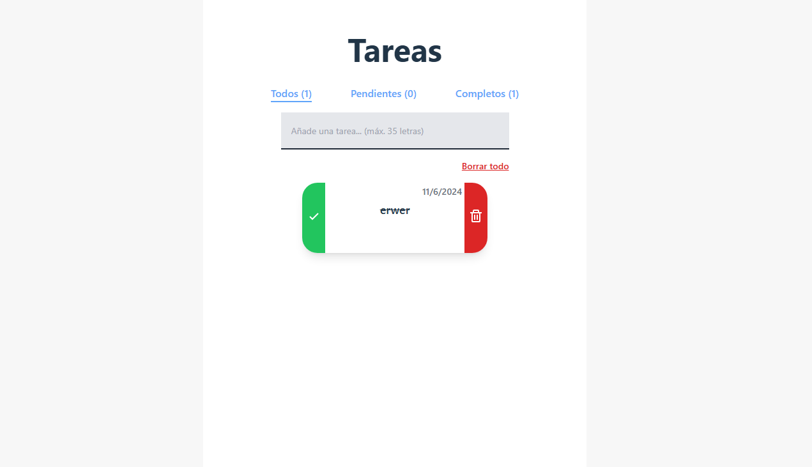

# Titulo del Proyecto

Aplicación de Tareas por Hacer


## Descripción

Nuestra aplicación de tareas ha sido mejorada e integrada utilizando TypeScript y TailwindCSS. Originalmente desarrollada en JavaScript con React, esta versión actualizada ofrece una mayor robustez y estilización gracias a las tecnologías implementadas.


## Autor

- [@JackAlvites](https://github.com/JackAlvites12)


## Setup del proyecto

Clonamos el proyecto

```bash
  git clone https://github.com/JackAlvites12/todo-app.git
```

Vamos a la carpeta del proyecto

```bash
  cd todo-app-ts
```

Instalamos los módulos de Node 

```bash
  npm install
```
Arrancamos en el servidor local

```bash
  npm run dev
```

Extra ( Si queremos realizar modificaciones en el diseño debemos correr el scanner de tailwind para poder reflejar cambios, NOTA: personalizar en package.json )

```bash
    npm run scanTailwind
```

## Capturas de pantalla
